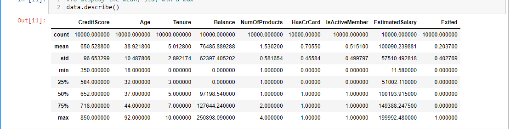

# Bank-Customer-Churn

## Introduction
Customer attrition prediction in the banking sector utilizes data analysis to assess customer actions and detect possible churn. An alternative approach involves tracking the company's Net Promoter Score (NPS) over a period to enable banks to implement proactive strategies for averting customer loss and enhancing customer loyalty.

### Prepare:
The dataset used for this analysis was downloaded from Kaggle. The dataset comes in a CSV format with thousands of rows. 
The dataset was imported to Python, cleaned and analyzed.

### Analyze: Analysis Insights: 
Import Required Library

### Exploratory Analysis: This step is important to better understand the dataset
Here, I explored the first 5 rows and also the number of rows and columns in the dataset.

This shows all the column names in the dataset

Display the number of rows not null and the data type

Display the data type

Display the total number of missing values present in the dataset

To check for duplicated data

To remove columns not needed for the analysis (ensure to save it in a new variable name)

## Descriptive Statistics For Numerical Columns
To display the mean, std, min & max

## Descriptive Statistics For Object dtype Columns
To describe and display unique values

## Univariate Analysis on Numerical Variable

Combine 2 plots in a single plot(e.g creditscore & age)

## Univariate Analysis on Categorical Columns

## Bivariate Analysis
Display the impact of gender on the exit rate (0=NO, 1=YES)

## Multivariate Analysis
Let's check the heatmap for the data with respect to the correlation

## Observation/Conclusion
* In this dataset, there were 10,000 participants, the male gender was more than the female with 5457 male participants and 4543 female participants
* France had the highest count of participants with about 5014 participants, 2509 participants from Germany and 2477 participants from Spain
* About 79.63% (7963) participants are still with the bank and 20.37% (2037) of the participants had exited the bank.
* About 7099 participants have Creditcards and 5151 active members among the participants.
* In the univariate analysis, the credit score is negatively skewed, the age distribution is positively skewed, and the tenure distribution is symmetric with some outliers in the credit score and age
* The effect of gender on churn rate shows that female customers are more likely to exit or churn from the product or services across all three countries.
* Looking at the correlation map, exited is closely correlated with age by the correlation factor 0.29. So, that means the single determinant of how people churn is age.

## Recommendations
To prevent customer churn, banks should create products that appeal to different age groups, prioritize enhancing the customer journey, deliver superior products and services, maintain competitive pricing, and ensure digital accessibility. Furthermore, it's crucial for banks to actively interact with their customers, heed their input, and promptly resolve their issues.

