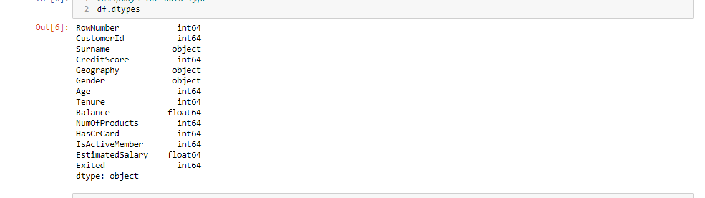
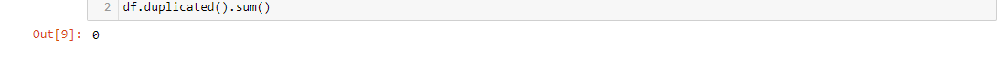
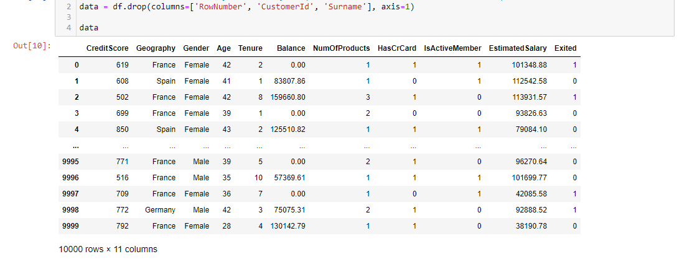
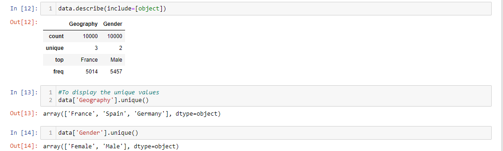
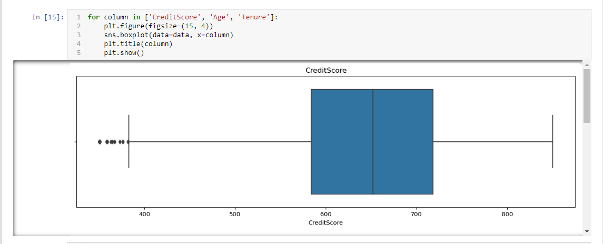
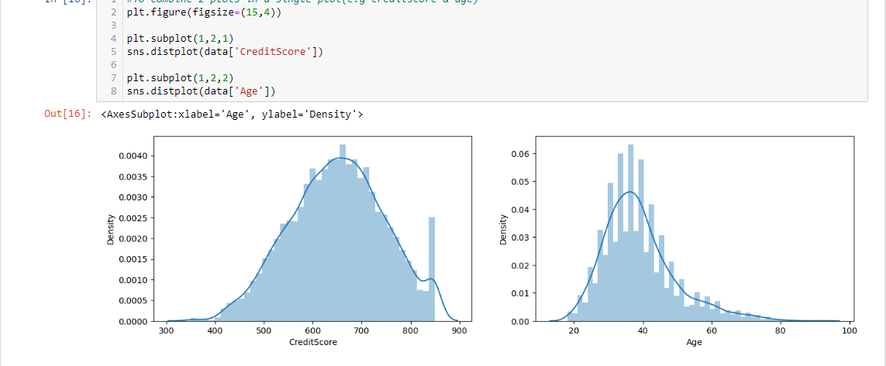

# Bank-Customer-Churn
Customer attrition prediction in the banking sector utilizes data analysis and machine learning methodologies to assess customer actions and detect possible churn. An alternative approach involves tracking the company's Net Promoter Score (NPS) over a period to enable banks to implement proactive strategies for averting customer loss and enhancing customer loyalty.
## Phase 4: Analyze
### Analysis Insights: 
Import Required Library

### Exploratory Analysis: This step is important to better understand the dataset
Here, I explored the first 5 rows and also the number of rows and columns in the dataset.

This shows all the column names in the dataset

Display the number of rows not null and the data type

Display the data type

Display the total number of missing values present in the dataset

To check for duplicated data

To remove columns not needed for the analysis (ensure to save it in a new variable name)

## Descriptive Statistics For Numerical Columns
To display the mean, std, min & max

## Descriptive Statistics For Object dtype Columns
To describe and display unique values

## Univariate Analysis on Numerical Variable

Combine 2 plots in a single plot(e.g creditscore & age)

